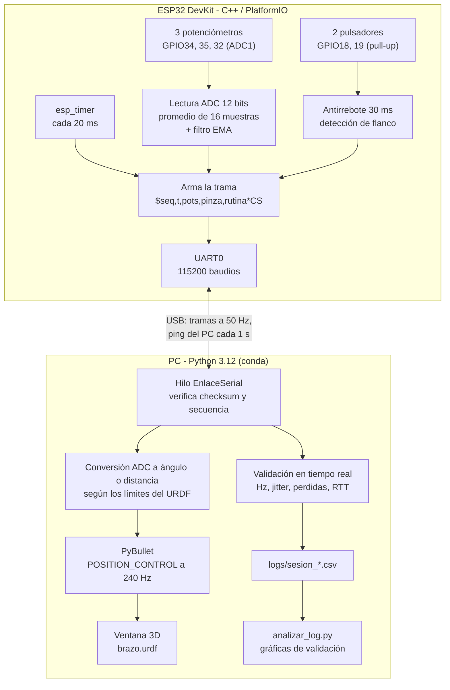
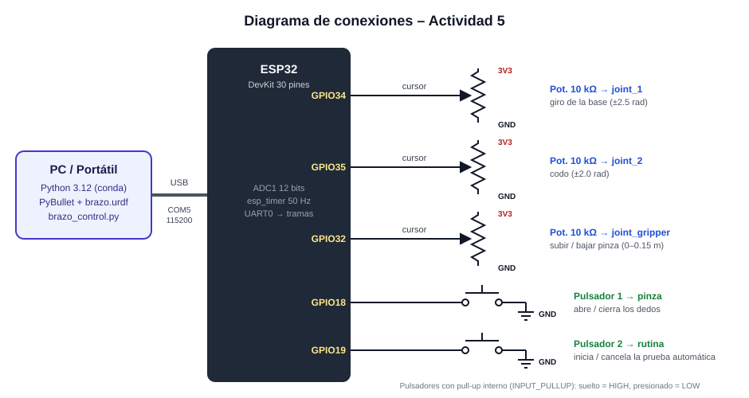
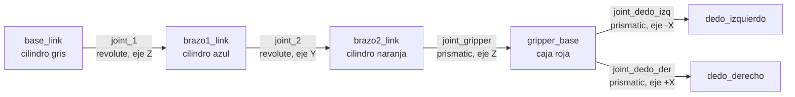
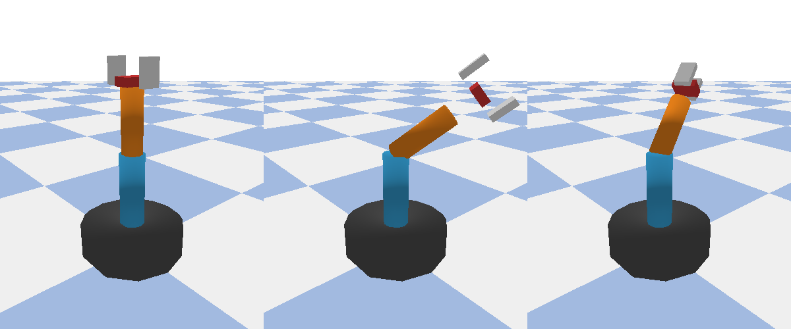
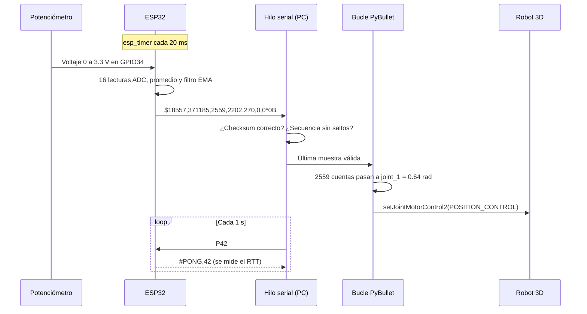
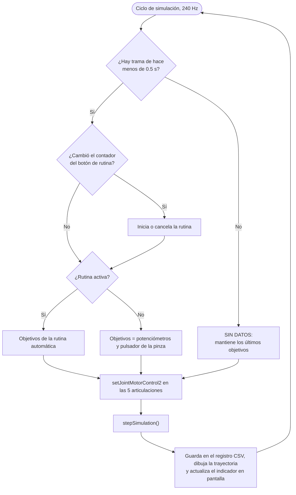
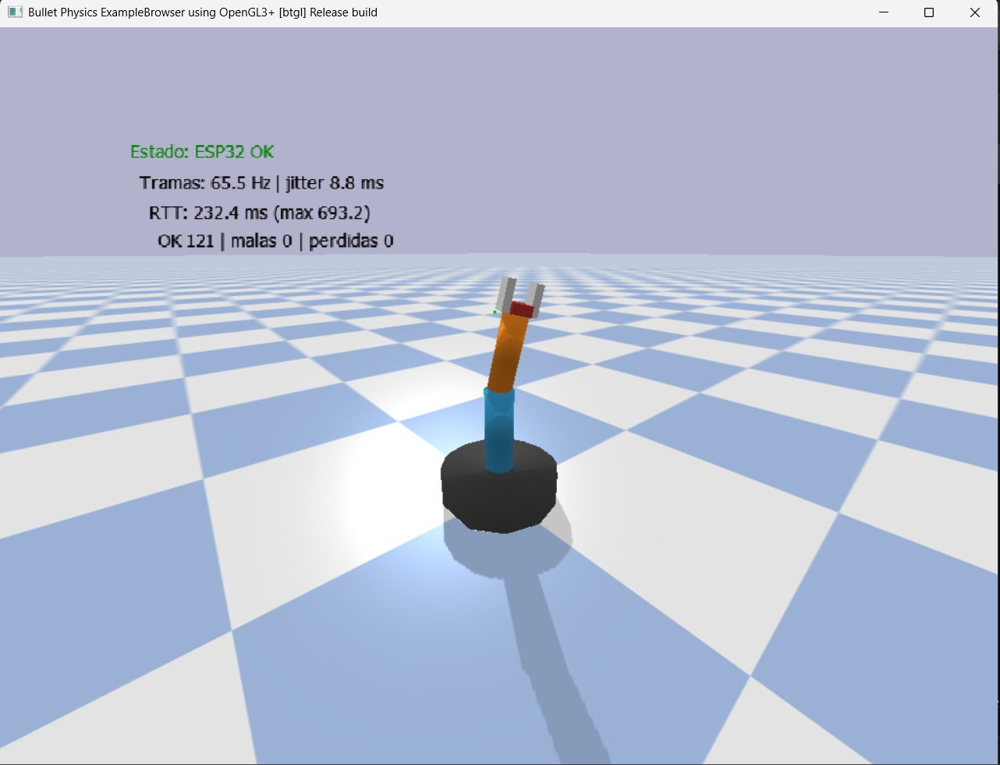
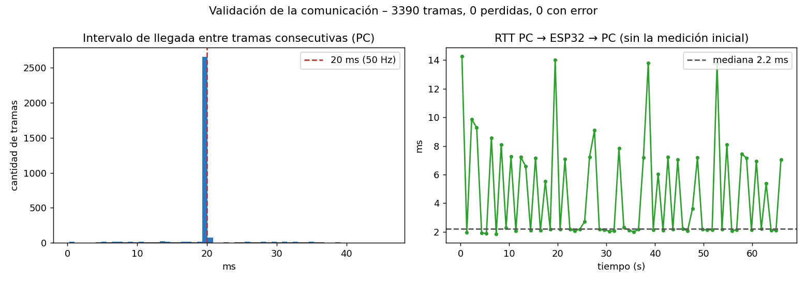
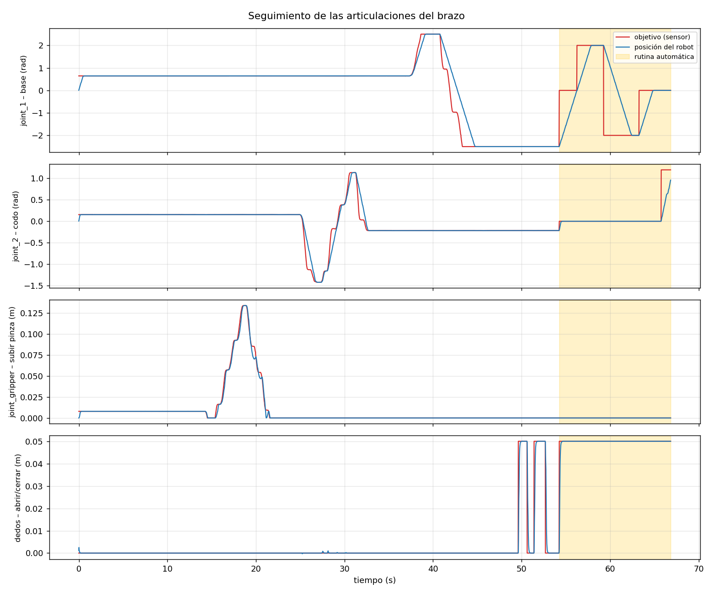

# Actividad 5 – Control de un brazo robótico (URDF) con ESP32 y Python

**Universidad Militar Nueva Granada – Ingeniería Mecatrónica**<br>
**Asignatura:** Micros y Laboratorio<br>
**Autor:** Faber Alexander Rodriguez Hernandez<br>
**Código:** 7004488

Sistema en el que un **ESP32** lee 3 potenciómetros y 2 pulsadores y envía los datos por **UART (USB-Serial)** a un script de **Python**. El script mueve en tiempo real el brazo robótico del archivo `brazo.urdf`, simulado en **PyBullet**. El modelo URDF viene del repositorio del curso [U_Militar / 8) Brazo_URDF](https://github.com/dialejobv/U_Militar/tree/main/8%29%20Brazo_URDF).

| Sensor | Pin del ESP32 | Articulación del robot | Rango |
|---|---|---|---|
| Potenciómetro 1 (10 kΩ) | GPIO34 | `joint_1`: giro de la base | −2.5 a 2.5 rad (±143°) |
| Potenciómetro 2 (10 kΩ) | GPIO35 | `joint_2`: codo | −2.0 a 2.0 rad (±115°) |
| Potenciómetro 3 (10 kΩ) | GPIO32 | `joint_gripper`: subir/bajar la pinza | 0 a 0.15 m |
| Pulsador 1 | GPIO18 | `joint_dedo_izq` y `joint_dedo_der`: abrir/cerrar | 0.05 m (abierta) / 0 m (cerrada) |
| Pulsador 2 | GPIO19 | Rutina automática de prueba | inicia / cancela |

**Resultado de la prueba:** 3390 tramas recibidas, **0 perdidas y 0 con error**. El ESP32 muestreó exactamente cada **20.00 ms** (50 Hz), y el tiempo de ida y vuelta (RTT) típico fue de **2.2 ms**.

---

## Contenido

1. [Arquitectura del sistema](#1-arquitectura-del-sistema)
2. [Funcionamiento y evidencias](#2-funcionamiento-y-evidencias)
3. [Análisis del proyecto](#3-análisis-del-proyecto)
4. [Materiales y software](#4-materiales-y-software)
5. [Paso a paso para replicarlo](#5-paso-a-paso-para-replicarlo)
6. [Explicación del código](#6-explicación-del-código)
7. [Estructura del repositorio](#7-estructura-del-repositorio)
8. [Problemas comunes y soluciones](#8-problemas-comunes-y-soluciones)
9. [Conclusiones](#9-conclusiones)
10. [Referencias](#10-referencias)

---

## 1. Arquitectura del sistema

### 1.1 Diagrama de bloques

El ESP32 hace el trabajo de tiempo real con el hardware: muestrear los sensores a una frecuencia fija, filtrar el ruido y leer los pulsadores sin rebotes. El PC hace el trabajo pesado: la física del robot y la visualización 3D. Los dos se comunican con una trama de texto por el puerto serie.



### 1.2 Diagrama de conexiones



| Componente | Conexión |
|---|---|
| Potenciómetros | Extremo 1 → **3V3**, extremo 2 → **GND**, cursor (pata del medio) → GPIO34, 35 o 32 |
| Pulsadores (2 patas) | Una pata → GPIO18 o GPIO19, la otra → **GND** (sin resistencia, se usa el pull-up interno) |
| ESP32 → PC | Cable micro-USB de datos (COM5) |

Los potenciómetros van a **3V3 y no a VIN (5 V)**, porque el ADC del ESP32 solo mide hasta ~3.3 V.

Se usan pines del **ADC1** (GPIO32 a 39) porque el ADC2 queda bloqueado cuando se usa el WiFi. GPIO34 y 35 son solo de entrada, lo que está bien para leer un potenciómetro.

### 1.3 El modelo URDF

El archivo `brazo.urdf` describe un robot con 6 eslabones (*links*) unidos por 5 articulaciones (*joints*):



| Articulación | Tipo | Eje | Límites | Esfuerzo máx. | Velocidad máx. |
|---|---|---|---|---|---|
| `joint_1` | Rotacional | Z | −2.5 a 2.5 rad | 100 N·m | 1.5 rad/s |
| `joint_2` | Rotacional | Y | −2.0 a 2.0 rad | 80 N·m | 1.2 rad/s |
| `joint_gripper` | Prismática | Z | 0 a 0.15 m | 30 N | 0.5 m/s |
| `joint_dedo_izq` | Prismática | −X | 0 a 0.05 m | 20 N | 0.5 m/s |
| `joint_dedo_der` | Prismática | +X | 0 a 0.05 m | 20 N | 0.5 m/s |


*El modelo en PyBullet: posición inicial con la pinza abierta; base y codo girados con la pinza extendida; y pinza cerrada.*

### 1.4 Recorrido de un dato (del potenciómetro al robot)



### 1.5 Lógica del script de control



---

## 2. Funcionamiento y evidencias

### 2.1 Cómo funciona

1. Al conectar el ESP32 empieza a enviar 50 tramas por segundo con la posición de los tres potenciómetros y el estado de los pulsadores.
2. Al ejecutar `brazo_control.py`, se abre PyBullet con el brazo. Cada potenciómetro mueve su articulación en tiempo real, dentro de los límites del URDF.
3. **Pulsador 1:** cada pulsación alterna la pinza entre abierta (dedos a 0.05 m) y cerrada (0 m).
4. **Pulsador 2:** inicia una rutina automática de unos 31 s que prueba una por una todas las articulaciones y la pinza. Mientras corre, los potenciómetros se ignoran. Si se presiona otra vez, la rutina se cancela.
5. En la ventana se muestran el estado de la conexión, las tramas por segundo, el jitter, el RTT y los contadores de tramas buenas, con error y perdidas. Una línea verde dibuja la trayectoria de la pinza.
6. Si el ESP32 se desconecta, aparece **SIN DATOS** y el robot se queda en su última posición.
7. Al cerrar la ventana, la sesión queda guardada en `control/logs/`, y `analizar_log.py` genera las gráficas de validación.

### 2.2 Captura de la ejecución



*Captura tomada unos segundos después de arrancar el script: el indicador ya muestra "ESP32 OK", 0 tramas con error y 0 perdidas. En ese primer instante, la frecuencia y el RTT todavía incluyen las tramas que estaban acumuladas en el búfer al abrir el puerto. Los valores estables de la sesión completa están en la sección 3.8.*

### 2.3 Validación de la comunicación en tiempo real

Gráficas generadas con `analizar_log.py` a partir de la sesión real ([`docs/evidencias/sesion_20260927_124655.csv`](docs/evidencias/sesion_20260927_124655.csv)):





En la segunda gráfica, la línea roja es lo que pide el sensor y la azul es la posición real del robot. La zona amarilla es la rutina automática.

---

## 3. Análisis del proyecto

### 3.1 Decisiones de diseño

| Decisión | Alternativas consideradas | Por qué se eligió |
|---|---|---|
| **Potenciómetros** para las 3 articulaciones continuas | Joystick, MPU6050 | Dan una posición **absoluta**: cada posición del potenciómetro corresponde a un ángulo del robot, así que no hay deriva ni se necesita calibrar |
| **Pulsador con alternancia** para la pinza | Potenciómetro proporcional | La pinza tiene solo dos estados útiles (abierta o cerrada) y un botón es más natural para agarrar y soltar |
| **Trama de texto con checksum** | Binaria, JSON | Se puede leer en el monitor serie para depurar, es fácil de validar y a 50 Hz usa solo ~16 % del canal |
| **PyBullet** (el mismo motor del ejemplo del curso) | RViz / ROS, visor web | Carga el URDF directamente, simula la física y tiene control de posición en las articulaciones |
| **Python 3.12 con conda-forge** | pip en Python 3.14 | PyBullet no tiene instaladores listos para Windows en PyPI (pip lo compila y necesita Visual C++). conda-forge lo trae ya compilado |

### 3.2 Lectura de los potenciómetros

- **Resolución del ADC:** 12 bits, es decir 0 a 4095 cuentas para 0 a ~3.3 V.
- **Sobremuestreo:** cada lectura es el promedio de 16 conversiones. Para ruido aleatorio, esto reduce la desviación estándar en un factor √16 = 4.
- **Filtro exponencial (EMA):** y[k] = α·x[k] + (1 − α)·y[k−1], con α = 0.35 y periodo de muestreo T = 20 ms.
  - Constante de tiempo: τ = −T / ln(1 − α) = −0.02 / ln(0.65) ≈ **46 ms**.
  - Frecuencia de corte aproximada: f<sub>c</sub> = 1 / (2πτ) ≈ **3.4 Hz**.
  - Esto elimina el temblor de la lectura sin que se note retardo al mover la perilla con la mano.
- **Conversión a la articulación:** el ADC del ESP32 no es lineal en los extremos, así que se dejan zonas muertas (ADC<sub>mín</sub> = 60, ADC<sub>máx</sub> = 4035):

$$q = q_{min} + \mathrm{sat}_{[0,1]}\!\left(\frac{ADC - 60}{4035 - 60}\right)\,(q_{max} - q_{min})$$

  La resolución que se obtiene es ≈ 5 rad / 3975 cuentas = **1.26 mrad (0.072°)** en la base y 0.15 m / 3975 = **0.038 mm** en la pinza.

### 3.3 Pulsadores

- Se configuran con `INPUT_PULLUP`: suelto se lee **HIGH** y presionado **LOW**, sin resistencias externas.
- **Antirrebote por software:** un cambio solo se acepta si la lectura se mantiene estable más de 30 ms. Se detecta el **flanco de bajada**, así que mantener el botón presionado cuenta como una sola pulsación.
- La pinza se envía como **estado** (1 = abierta, 0 = cerrada) y la rutina como **contador** de pulsaciones. Así, aunque se pierda una trama, el PC no se pierde ninguna pulsación: el siguiente estado o contador que llega ya trae el cambio.

### 3.4 Protocolo de comunicación

```
$<seq>,<t_ms>,<pot_base>,<pot_codo>,<pot_pinza>,<pinza>,<rutina>*<CS>\r\n
```

| Campo | Ejemplo | Para qué sirve |
|---|---|---|
| `$` | `$` | Marca el inicio de la trama |
| `seq` | `18557` | Contador de 0 a 65535; un salto indica tramas perdidas |
| `t_ms` | `371185` | `millis()` del ESP32 al tomar la muestra; mide el periodo real en el origen |
| `pot_*` | `2559,2202,270` | Lecturas filtradas del ADC |
| `pinza` | `0` | 1 = abierta, 0 = cerrada |
| `rutina` | `0` | Contador de pulsaciones del botón de rutina |
| `*CS` | `*0B` | XOR de todos los caracteres entre `$` y `*`, en hexadecimal |

Ejemplo real: `$18557,371185,2559,2202,270,0,0*0B` ocupa 36 bytes con el `\r\n`. A 50 Hz y 10 bits por byte son 36 × 10 × 50 = **18 000 bit/s**, el **15.6 %** de la capacidad a 115200 baudios. Queda margen de sobra.

El PC envía `P<n>` cada segundo y el ESP32 responde de inmediato `#PONG,<n>`. La diferencia de tiempo es el **RTT** (ida y vuelta): mide la latencia real del enlace USB-UART sin necesidad de sincronizar los relojes.

### 3.5 Muestreo con temporizador

El muestreo lo marca un temporizador periódico del ESP-IDF (`esp_timer`) cada 20 000 µs. El callback solo levanta una bandera, y el `loop()` hace la lectura y el envío. El `loop()` nunca usa `delay()`, así que sigue revisando los pulsadores y respondiendo los *ping* mientras espera el siguiente periodo.

### 3.6 Control del robot en PyBullet

- La simulación corre a 240 Hz (`DT_SIM = 1/240 s`) con gravedad de −9.81 m/s².
- Cada articulación se controla con `POSITION_CONTROL`, usando como fuerza y velocidad máximas los valores `effort` y `velocity` del URDF. Por eso el robot **no salta** a la posición del potenciómetro: la alcanza a la velocidad máxima de la articulación, como lo haría un motor real.
- La lectura del puerto serie corre en **un hilo aparte**, así que la simulación nunca se frena esperando datos. El hilo guarda la última muestra válida, y el bucle de simulación la usa.

### 3.7 Rutina automática de prueba

La rutina, lanzada con el pulsador 2, prueba cada movimiento por separado y termina con un movimiento combinado:

| Paso | Duración | Movimiento |
|---|---|---|
| 1 | 2.0 s | Posición inicial, pinza abierta |
| 2–4 | 9.5 s | Base a +2.0 rad, luego a −2.0 rad, luego al centro |
| 5–7 | 8.5 s | Codo a +1.2 rad, luego a −1.2 rad, luego al centro |
| 8 | 1.5 s | Sube la pinza 0.15 m |
| 9–10 | 3.0 s | Cierra y abre los dedos |
| 11 | 1.5 s | Baja la pinza |
| 12 | 2.5 s | Movimiento combinado (base, codo y pinza) con los dedos cerrados |
| 13 | 2.5 s | Regreso a la posición inicial |

### 3.8 Resultados de la validación en tiempo real

Sesión de prueba de **66.8 s** ([registro CSV](docs/evidencias/sesion_20260927_124655.csv)):

| Métrica | Resultado | Interpretación |
|---|---|---|
| Tramas válidas | **3390** | – |
| Tramas perdidas | **0 (0 %)** | La secuencia llegó completa, sin saltos |
| Tramas con checksum inválido | **0** | Ningún dato corrupto |
| Frecuencia de recepción | **50.00 Hz** (objetivo 50 Hz) | El PC recibió exactamente lo que el ESP32 envió |
| Periodo de muestreo en el ESP32 | **20.00 ms** (mín = máx = 20.00 ms) | El temporizador `esp_timer` no se retrasó ni una vez |
| Intervalo de llegada al PC | media 19.97 ms, jitter 4.4 ms | El 84.8 % de las tramas llegó entre 18 y 22 ms después de la anterior, y el 96.2 % en 30 ms o menos |
| RTT, mediana | **2.2 ms** | Latencia de ida y vuelta del enlace USB-UART |
| RTT, mín / máx | **1.9 / 14.3 ms** | Sin contar la primera medición (751 ms), que se tomó al abrir el puerto, cuando todavía había datos acumulados en el búfer |

**Observaciones:**

- **El ESP32 es muy preciso; la variación aparece en el PC.** En el ESP32 todas las tramas salen exactamente cada 20 ms. En el PC se ve un jitter de ~4 ms, porque Windows entrega los datos del conversor USB-UART en paquetes y el hilo de Python comparte el procesador con la simulación. Por eso a veces llegan dos tramas casi juntas. Ninguna se pierde: el número de secuencia sigue completo.
- **Registro de la sesión.** En la versión con la que se grabó esta prueba, el registro escribía una fila por ciclo de simulación. Cuando llegaban dos tramas en el mismo ciclo (4 ms), solo se guardaba la última: el CSV tiene 3297 filas de las 3343 tramas recibidas en ese tiempo. Las tramas sí se recibieron y se usaron (el contador de perdidas es 0). `analizar_log.py` tiene esto en cuenta: calcula el periodo del ESP32 como Δt / Δseq y el intervalo de llegada solo entre tramas consecutivas. La versión actual de `brazo_control.py` ya escribe **una fila por cada trama**.
- **RTT.** La mayoría de las mediciones están en ~2 ms. Los picos de 7 a 14 ms se deben al manejo de USB en Windows y a que el hilo de comunicación de Python a veces espera su turno frente a la simulación. Aun así, el peor caso está por debajo de un periodo de muestreo (20 ms).
- **Seguimiento de las articulaciones.** En la gráfica de seguimiento, la posición del robot (azul) sigue al sensor (rojo) con una pendiente constante cuando el cambio es grande. Esa pendiente es la **velocidad máxima del URDF**, no un retardo de la comunicación. Por ejemplo, la base va de +2.5 a −2.5 rad (5 rad) en unos 3.3 s, que es justo 5 rad ÷ 1.5 rad/s. En movimientos lentos, como la pinza entre 15 y 22 s, las dos curvas prácticamente se superponen.
- **Conclusión:** con 0 tramas perdidas, un periodo exacto de 20 ms y una latencia típica de ~1 ms en un solo sentido (la mitad del RTT), **la comunicación es de tiempo real para esta aplicación**.

### 3.9 Posibles mejoras

- Enviar las tramas en formato binario (con marcador de inicio y CRC) para subir la frecuencia por encima de 50 Hz con el mismo ancho de banda.
- Calibrar el ADC con `analogReadMilliVolts()` para corregir la no linealidad de los extremos.
- Agregar más sensores: un joystick para la pinza, o un MPU6050 para mover el brazo inclinando la mano.

---

## 4. Materiales y software

**Hardware**

- ESP32 DevKit V1 (30 pines)
- 3 potenciómetros de 10 kΩ
- 2 pulsadores de 2 patas
- Protoboard, cables de conexión y cable micro-USB de datos

**Software**

| Herramienta | Versión | Uso |
|---|---|---|
| Windows | 11 | Sistema operativo |
| VS Code + PlatformIO | – | Compilar y cargar el firmware |
| Framework Arduino para ESP32 | plataforma `espressif32` | Firmware en C++ |
| Miniconda | – | Entorno de Python con PyBullet ya compilado |
| Python | 3.12 (entorno `brazo`) | Script de control |
| pybullet | conda-forge | Simulación del URDF |
| pyserial | conda-forge | Comunicación UART |
| matplotlib | conda-forge | Gráficas de validación |

---

## 5. Paso a paso para replicarlo

### Paso 1: Clonar el repositorio

```bash
git clone https://github.com/faberx10/Actividad5.git
cd Actividad5
```

### Paso 2: Montar el circuito

Conectar los componentes según el [diagrama de conexiones](#12-diagrama-de-conexiones).

### Paso 3: Cargar el firmware

1. Conectar el ESP32 y verificar el puerto en el Administrador de dispositivos (en este caso **COM5**; si es otro, cambiarlo en `firmware/platformio.ini`).
2. En VS Code: **PlatformIO → Open Project** → carpeta `firmware` → **Upload**. El `platformio.ini` usa `upload_speed = 115200`, que es la velocidad con la que la carga funcionó de forma confiable en esta placa.
3. Abrir el **Serial Monitor**. Deben aparecer 50 líneas por segundo del tipo `$123,4567,2048,1990,300,1,0*5A`.
4. Mover cada potenciómetro y presionar cada pulsador, y verificar que cambie su campo en la trama.
5. **Cerrar el Serial Monitor** antes de seguir.

### Paso 4: Crear el entorno de Python (una sola vez)

1. Instalar **Miniconda** para Windows 64-bit: https://www.anaconda.com/download/success
2. Abrir **Anaconda Prompt (miniconda3)** y ejecutar:

```bash
cd ruta\a\Actividad5\control
conda env create -f environment.yml
conda activate brazo
```

### Paso 5: Probar el robot sin el ESP32

```bash
python brazo_control.py --sin-serial
```

Se abre PyBullet con controles deslizantes para mover cada articulación, abrir y cerrar la pinza y lanzar la rutina automática.

### Paso 6: Ejecutar el sistema completo

```bash
python brazo_control.py              # usa COM5
python brazo_control.py --port COM7  # si el puerto es otro
```

### Paso 7: Validar la comunicación

Cerrar la ventana de PyBullet y ejecutar:

```bash
python analizar_log.py
```

Imprime la frecuencia, el jitter, las tramas perdidas y el RTT de la última sesión, y guarda dos gráficas PNG en `control/logs/`.

---

## 6. Explicación del código

### 6.1 Firmware: `firmware/src/main.cpp`

**a) Pines.** Los potenciómetros van en ADC1 y los pulsadores en GPIO de propósito general:

```cpp
const uint8_t PIN_POT_BASE  = 34;  // joint_1       (giro de la base)
const uint8_t PIN_POT_CODO  = 35;  // joint_2       (codo)
const uint8_t PIN_POT_PINZA = 32;  // joint_gripper (subir / bajar pinza)
const uint8_t PIN_BTN_PINZA  = 18;  // abre / cierra los dedos
const uint8_t PIN_BTN_RUTINA = 19;  // lanza la rutina automática de prueba
```

**b) Temporizador de muestreo.** `esp_timer` llama a `alVencerTimer()` cada 20 ms. El callback solo levanta una bandera `volatile`, porque dentro de él no conviene hacer trabajo pesado:

```cpp
volatile bool tocaMuestrear = false;
void alVencerTimer(void *) { tocaMuestrear = true; }

// en setup():
esp_timer_create_args_t args = {};
args.callback = &alVencerTimer;
args.name = "muestreo";
esp_timer_create(&args, &timerMuestreo);
esp_timer_start_periodic(timerMuestreo, PERIODO_US);   // 20000 µs
```

**c) Lectura con sobremuestreo y filtro EMA.**

```cpp
uint16_t leerPromedio(uint8_t pin) {
  uint32_t suma = 0;
  for (uint8_t i = 0; i < MUESTRAS_ADC; i++) suma += analogRead(pin);  // 16 lecturas
  return suma / MUESTRAS_ADC;
}
// en loop(), cada 20 ms:
filtro[i] = ALFA_EMA * leerPromedio(PINES_POT[i]) + (1.0f - ALFA_EMA) * filtro[i];
```

**d) Pulsadores con antirrebote.** `fuePresionado()` devuelve `true` solo en el instante en que la lectura pasa a `LOW` y lleva estable más de 30 ms:

```cpp
bool fuePresionado(Boton &b) {
  bool lectura = digitalRead(b.pin);
  if (lectura != b.lecturaAnterior) { b.tCambio = millis(); b.lecturaAnterior = lectura; }
  if ((millis() - b.tCambio) > REBOTE_MS && lectura != b.estadoEstable) {
    b.estadoEstable = lectura;
    if (lectura == LOW) return true;
  }
  return false;
}
// en loop():
if (fuePresionado(btnPinza)) pinzaAbierta = !pinzaAbierta;
if (fuePresionado(btnRutina)) contadorRutina++;
```

**e) Trama con checksum.** Se arma el texto con `snprintf`, se calcula el XOR de sus caracteres y se envía entre `$` y `*`:

```cpp
int n = snprintf(datos, sizeof(datos), "%u,%lu,%u,%u,%u,%u,%u",
                 secuencia, (unsigned long)millis(),
                 (uint16_t)filtro[0], (uint16_t)filtro[1], (uint16_t)filtro[2],
                 pinzaAbierta ? 1 : 0, contadorRutina);
uint8_t cs = 0;
for (int i = 0; i < n; i++) cs ^= (uint8_t)datos[i];
Serial.printf("$%s*%02X\r\n", datos, cs);
secuencia++;
```

**f) Respuesta al ping.** `atenderSerial()` acumula los caracteres que llegan del PC. Cuando se completa una línea que empieza por `P`, responde de inmediato con `#PONG,<n>`:

```cpp
if (idxRx > 1 && bufRx[0] == 'P') {
  Serial.printf("#PONG,%s\r\n", bufRx + 1);
}
```

**g) `loop()`.** Revisa los pulsadores y los *ping* en cada vuelta, y cuando el temporizador levanta la bandera, lee los potenciómetros y envía la trama:

```cpp
void loop() {
  if (fuePresionado(btnPinza)) pinzaAbierta = !pinzaAbierta;
  if (fuePresionado(btnRutina)) contadorRutina++;
  atenderSerial();
  if (tocaMuestrear) {
    tocaMuestrear = false;
    for (uint8_t i = 0; i < 3; i++) { /* lectura + EMA */ }
    enviarTrama();
  }
}
```

### 6.2 Control: `control/brazo_control.py`

**a) Hilo de comunicación (`EnlaceSerial`).** Abre el puerto con DTR y RTS en bajo para que el ESP32 no se reinicie. Luego, en un hilo aparte, lee los bytes, arma las líneas y envía un *ping* cada segundo:

```python
def run(self):
    while self.corriendo:
        if ahora - t_ping >= 1.0:
            self._n_ping += 1
            self._pings[self._n_ping] = time.perf_counter()
            self.ser.write(f"P{self._n_ping}\n".encode())
        datos = self.ser.read(self.ser.in_waiting or 1)
        buf += datos
        while b"\n" in buf:
            linea, buf = buf.split(b"\n", 1)
            self._procesar(linea.decode(errors="ignore").strip(), t_llegada)
```

**b) Validación de cada trama.** Se verifica el formato con una expresión regular, se recalcula el checksum y se revisa el salto en la secuencia:

```python
TRAMA = re.compile(r"^\$([^*]+)\*([0-9A-Fa-f]{2})$")
...
cs = 0
for c in cuerpo:
    cs ^= ord(c)
if cs != cs_recibido or len(campos) != 7:
    self.tramas_malas += 1
    return
salto = (seq - self._seq_anterior - 1) % 65536   # tramas perdidas
```

**c) RTT.** Cuando llega `#PONG,<n>`, se resta la hora en que se envió el *ping* `n`:

```python
if linea.startswith("#PONG,"):
    n = int(linea[6:])
    t_envio = self._pings.pop(n, None)
    rtt = (t - t_envio) * 1000.0
```

**d) Carga del robot.** Los límites, la fuerza y la velocidad de cada articulación se leen **del propio URDF** con `getJointInfo`, así que no se escriben a mano en el código:

```python
robot = p.loadURDF(URDF, [0, 0, 0], useFixedBase=True)
for i in range(p.getNumJoints(robot)):
    info = p.getJointInfo(robot, i)
    juntas[info[1].decode()] = {"id": i, "min": info[8], "max": info[9],
                                "fuerza": info[10], "vel": info[11]}
```

**e) Conversión del ADC y control de posición.**

```python
def adc_a_rango(adc, bajo, alto):
    n = (adc - ADC_MIN) / (ADC_MAX - ADC_MIN)
    n = min(max(n, 0.0), 1.0)
    return bajo + n * (alto - bajo)

def mover(robot, juntas, nombre, objetivo):
    j = juntas[nombre]
    p.setJointMotorControl2(robot, j["id"], p.POSITION_CONTROL, targetPosition=objetivo,
                            force=j["fuerza"], maxVelocity=j["vel"])
```

**f) Rutina automática.** Es una lista de pasos `(duración, joint_1, joint_2, joint_gripper, dedos)`. `objetivo_rutina(t)` devuelve el paso que corresponde al tiempo transcurrido, o `None` cuando la rutina termina:

```python
RUTINA = [
    (2.0,  0.0,  0.0, 0.00, DEDOS_ABIERTOS),   # posición inicial
    (3.0,  2.0,  0.0, 0.00, DEDOS_ABIERTOS),   # base a la izquierda
    ...
]
```

**g) Bucle principal.** En cada ciclo de 1/240 s: toma la última muestra, decide los objetivos (rutina, potenciómetros o, si no hay datos, los últimos), manda los objetivos a los motores y avanza la simulación. Después escribe en el CSV **una fila por cada trama** recibida desde el ciclo anterior (el hilo serial las acumula en `pendientes`), dibuja la trayectoria y actualiza el indicador en pantalla. Al final espera lo necesario para que la simulación vaya en **tiempo real**:

```python
espera = DT_SIM - (time.perf_counter() - ahora)
if espera > 0:
    time.sleep(espera)
```

### 6.3 Análisis: `control/analizar_log.py`

Lee el CSV de la sesión y calcula:

- la frecuencia de recepción, a partir del contador de tramas válidas;
- el periodo de muestreo real del ESP32, como Δt<sub>ESP32</sub> / Δseq;
- el intervalo de llegada al PC entre tramas consecutivas, con su jitter (desviación estándar) y su percentil 95;
- las tramas perdidas y con error;
- las estadísticas del RTT.

Todo se calcula de forma que el resultado sea correcto aunque falten filas en el registro. Genera `*_comunicacion.png` (histograma de intervalos y RTT en el tiempo) y `*_articulaciones.png` (objetivo contra posición real de cada articulación).

---

## 7. Estructura del repositorio

```
Actividad5/
├── README.md
├── .gitignore
├── docs/
│   ├── conexiones.svg            ← diagrama de conexiones
│   ├── modelo_urdf.png           ← render del modelo en PyBullet
│   ├── captura_pybullet.png      ← captura de la ejecución
│   └── evidencias/
│       ├── sesion_20260927_124655.csv   ← registro real de la prueba
│       ├── comunicacion.png
│       └── articulaciones.png
├── firmware/                     ← proyecto PlatformIO (ESP32, C++)
│   ├── platformio.ini
│   └── src/main.cpp
└── control/                      ← Python + PyBullet
    ├── brazo.urdf                ← modelo del repositorio del curso
    ├── brazo_control.py
    ├── analizar_log.py
    ├── environment.yml
    └── logs/                     ← registros de las sesiones de prueba
```

---

## 8. Problemas comunes y soluciones

| Problema | Causa | Solución |
|---|---|---|
| `Failed to connect to ESP32: No serial data received` al subir | El puerto COM5 está abierto en otro programa (Serial Monitor o el script de Python), o la velocidad de carga es muy alta para la placa | Cerrar todo lo que use COM5, usar `upload_speed = 115200` en `platformio.ini` y, si sigue fallando, mantener presionado **BOOT** durante `Connecting...` |
| `No se pudo abrir COM5` en Python | El Serial Monitor está abierto | Cerrarlo |
| `pip install pybullet` falla en Windows | No hay instalador precompilado y falta Visual C++ | Usar el entorno de conda (`environment.yml`) |
| Mensajes `No inertial data for link` | El URDF no define masas ni inercias | Es una advertencia; PyBullet asigna 1 kg por eslabón y funciona normal |
| El indicador muestra **SIN DATOS** | El ESP32 no está enviando o se desconectó | Revisar el cable y el puerto; verificar las tramas en el Serial Monitor |
| Un potenciómetro no llega al extremo del movimiento | No linealidad del ADC en los extremos | Ajustar `ADC_MIN` y `ADC_MAX` en `brazo_control.py` |
| La articulación se mueve al revés | Los extremos del potenciómetro están invertidos | Intercambiar los cables de 3V3 y GND de ese potenciómetro |

---

## 9. Conclusiones

- Separar el sistema funcionó bien: el ESP32 hace la adquisición de tiempo real (temporizador, filtrado y antirrebote) y el PC la simulación física. Así se pudo controlar un modelo URDF de 5 articulaciones con hardware sencillo.
- La trama con número de secuencia, marca de tiempo y checksum permitió **medir** la calidad de la comunicación en vez de suponerla. En la prueba no hubo tramas perdidas ni corruptas en 3390 tramas, y la latencia de ida y vuelta típica fue de 2.2 ms. La comunicación es de tiempo real para esta aplicación.
- La marca de tiempo del ESP32 y el número de secuencia permitieron separar lo que pasa en el microcontrolador (periodo exacto de 20.00 ms) de lo que pasa en el PC (jitter de ~4 ms por USB y Windows). Sin esa información en la trama, la variación del PC se habría atribuido por error al ESP32.
- Controlar las articulaciones con `POSITION_CONTROL` y los límites del URDF hace que el robot respete su velocidad máxima. La diferencia entre la curva del sensor y la del robot se debe a esa dinámica, no a la comunicación.
- La rutina automática y el modo `--sin-serial` permitieron probar cada articulación y la pinza de forma repetible, independiente del operador.

---

## 10. Referencias

- Repositorio del curso: *U_Militar – 8) Brazo_URDF*. https://github.com/dialejobv/U_Militar/tree/main/8%29%20Brazo_URDF
- Coumans, E. y Bai, Y. *PyBullet Quickstart Guide*. https://docs.google.com/document/d/10sXEhzFRSnvFcl3XxNGhnD4N2SedqwdAvK3dsihxVUA
- ROS Wiki. *URDF XML specification*. http://wiki.ros.org/urdf/XML
- Espressif Systems. *ESP Timer (High Resolution Timer)*. https://docs.espressif.com/projects/esp-idf/en/stable/esp32/api-reference/system/esp_timer.html
- Espressif Systems. *Arduino-ESP32 ADC API*. https://docs.espressif.com/projects/arduino-esp32/en/latest/api/adc.html
- pySerial documentation. https://pyserial.readthedocs.io/
- conda-forge. *pybullet package*. https://anaconda.org/conda-forge/pybullet
